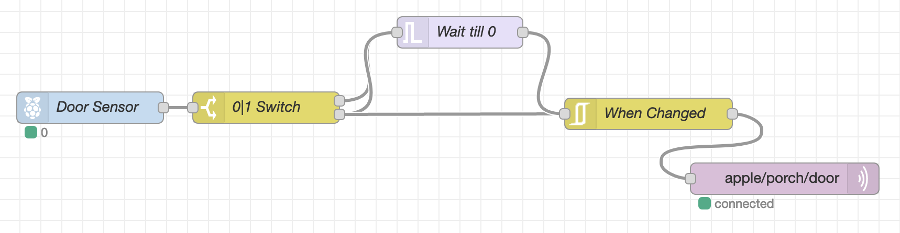

As part of an ongoing project to add some automated security to my porch, I need to know when the door has been opened. I will use a Magnetic Sensor connected to the GPIO input along with MQTT and NodeRed.

## Door Sensor

You will need a "Magnetic Reed Switch" like one of [these](
https://www.amazon.co.uk/sourcing-map-Surface-Sensor-Magnetic/dp/B07F6622NZ/ref=sr_1_10?dchild=1&keywords=magnetic+door+sensor&qid=1596139410&sr=8-10) (you can find these **much** cheaper than on Amazon. Check ebay).

### Connecting to GPIO

As the wires connected to sensor are quite short, I also bought a some [wire](https://www.amazon.co.uk/Merriway%C2%AE-BH01468-Standard-Thermostat-Intercom/dp/B00JIL9F12/ref=sr_1_7?dchild=1&keywords=bell+wire&qid=1596140010&sr=8-7) in order to extend the reach. The 2 wires then need to be connected to a GPIO input and a 3v3 pin.

## NodeRed

We now need to connect up the GPIO values to MQTT using NodeRed. First let's have a look a the flow then I'll explain why each node is needed.

The reason for these nodes is because the output from the GPIO is inconsistent. When the door is closed, the GPIO reports 0 which is good. However, when the door is opened, the reading constantly flips between 0 and 1. I need to smooth these values out before I publish the values on MQTT. The logic in the flow is this:

* If a 1 is reported from GPIO, we know the door is definitely open, so publish that to MQTT
* If a 0 is reported, wait for 250ms. If a 1 is reported within 250ms, restart the wait. Eventually a 1 won't be reported in that time frame and we can publish a 0 on MQTT because we know the door is now closed.

From left to right we have these nodes:

* Door Sensor - A 'rpi gpio in' node. Read the GPIO values
* 0|1 Switch - First output is when value `==0`, second one is `==1`
* Wait till 0 - A 'trigger' node. This is where the logic happens I described above. We feed in both the 0 and 1 values from the switch. The node properties read "Send `Nothing`, then `wait 250ms` (extend delay if new message arrives), then send `0`. Reset trigger if msg.payload equals `1`".
* When Changed - An 'rbe' (Report By Exception) node. This essentially makes sure that the flows only report a 0 and a 1 when the value changes. The 'Mode' is set to "block unless value changes".
* MQTT Publish - Finally, the value is published to an MQTT topic to be picked up by other parts of the home automation system I am putting together.
