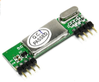

As part of a project to do some DIY security at my house, I want my Raspberry PI to be able to recognise when my door bell has been pushed, as well as to be able to sound the bell when it needs to.

## Requirements

You will need:

### Door Bell

A wireless doorbell which transmits on the 433mhz frequency. Amazon is awash with them, but I have [this one](https://www.amazon.co.uk/gp/product/B071ZJ63N1/ref=ppx_yo_dt_b_search_asin_title?ie=UTF8&psc=1). Check the details or comments to make sure it uses 433mhz as some wireless doorbells are on a different frequency.

### 433mhz transmitter/receiver

There are a couple of different types of receiver to choose from. From experience you DO NOT want the receiver that is listed as "XY-MK-5V 433Mhz". They are cheap and terrible and even if by adding a specifically sized antenna, the maximum range I ever got was about a meter.
Instead, you will want a receiver that is labelled as "RXB6" and looks like this:

With the RXB6 receiver, even without an antenna, I was able to get the Pi to pick signals from all the way across the house. The difference was incredible.

The transmitter that is labelled as "XY-FST 433MHz" seems to be ample for our use, even without an antenna attached.

### Pi

I am expecting that you already own a Pi of some description as well as any neccessary connector cables and breadboard.

## Listening to bell pushes

First let's hook up the receiver. There are eight pins on the receiver, but we are only going to use 3 of those.

[Picture here]

For testing, we can 
https://github.com/milaq/rpi-rf